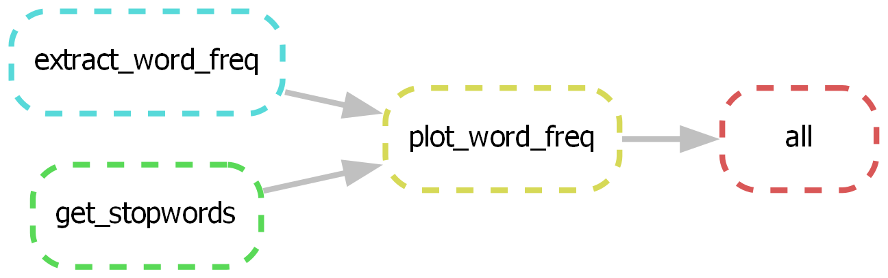

A Minimalist Workflow for Snakemake
===================================

This workflow structure is modified from Snakemake's [recommended workflow][snk-flow] with two enhancements.

1. **Simplified directory names**
   
    `resources/` is renamed as `raw/`, and `results/` is renamed as `made/`. The
    `workflow/` directory is broken down into `src/` (holding scripts) and the
    `Snakefile`.

2. **Consistent relative paths**
   
    Since `Snakefile` is now placed in the project root, the problem of
    different relative paths for different directives is resolved, as long as
    the user always invokes the command `snakemake -c` in the project root.

```tree
├── README.md
├── Snakefile
├── made
├── raw
└── src
```

Refer to [this post][post] for context and details.


## Usage

```bash
bash make.sh    # reproduce everything (e.g., dag.png)
# snakemake -c  # directly invoke snakemake command
```




[snk-flow]: https://snakemake.readthedocs.io/en/stable/snakefiles/deployment.html#distribution-and-reproducibility
[post]: https://yongfu.name/2023/02/15/snakemake/
